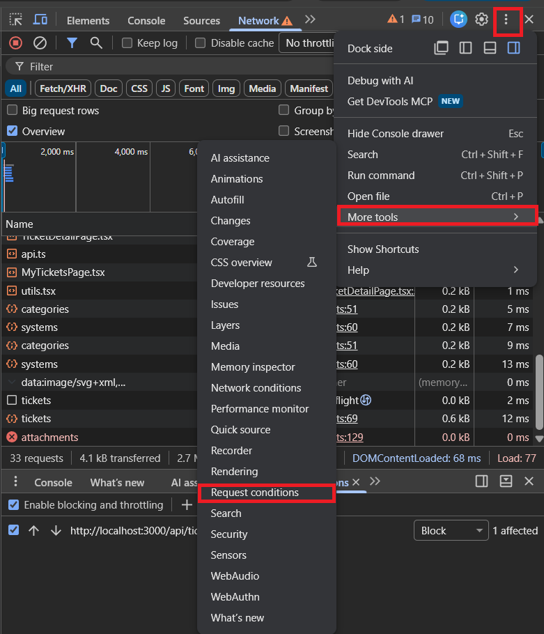

# Lab 2 — Peer Review Record  (fill this in)

**Author:** <ธีรกาญจน์ น้อยรักษา> — <67070501062> — GitHub: @<RBKarnz>
**Peer reviewer:** <เมธิภัทร มั่นทรัพย์> — <67070501071> — GitHub: @<Bobbie-CPE38>

## Pull Requests I authored (reviewed by my partner)
| PR | Branch | Reviewer verdict |
|----|--------|------------------|
| #17 | feature/lab2-specs | Approved |
| #25 | feature/lab2-requester-context | Approved |
| #26 | feature/lab2-create-ticket | Approved |
| #27 | feature/lab2-my-tickets | Approved |
| #28 | feature/lab2-ticket-detail | Approved |
| #29 | feature/lab2-attachment | Approved |
| #30 | feature/lab2-final-tests | Approved |

### Reviewer comments I received

### PR #17: feature/lab2-specs
- **Link:** https://github.com/RBKarnz/TokTickIT/pull/17
- **Issue** https://github.com/RBKarnz/TokTickIT/issues/18
- **Comment:** 
 **Reviewer comment I received:**
    **Comment 1**
    ```
    There're several topic missing from these files in docs/lab-02:
        - api-spec.md
        - ui-spec.md
        - tests.md
        - specification.md
    ```

    **Comment 2**
    ```
    Incomplete Query Contract for GET /api/tickets (Section 6.1):
        - Missing filter query parameters: category / categoryId, priority / requestedPriority, and status / currentStatus.
        - Missing default sorting (createdAt DESC, secondary sort id DESC) and behavior for invalid query parameters.
    ```

    **Comment 3**
    ```
    Missing Endpoint:
        - GET /api/attachments/:id (Retrieve Attachment metadata) is required by PDF Section 6.
    Status Codes & Error Shapes (Section 6.3 & 6.4):
        - Missing standard error response payload schema (e.g., { error: { code: string, message: string } }).
        - Missing status codes 409 Conflict and 500 Internal Server Error fallback.
    ```

    **Comment 4**
    ```
    Missing Business Rules (Section 4.3 & 4.5):
        - Duplicate Submission Prevention: Missing a rule specifying that the Submit button must enter a busy state and disable user interaction while the request is in flight.
        - Data Preservation on Error: Missing a rule stating that form input must be preserved if backend validation or submission fails.
        - Requester Switching Behavior: Missing explicit rules for clearing active ticket detail/cached states and refreshing data when switching the active Development Requester.
        - Empty State vs. No-Results State: Missing explicit distinction between when a user has zero tickets (Empty) versus when filters/search yield zero tickets (No Results).
        - Safe Attachment Filenames & Storage: Missing rules on safe filename generation/hashing to prevent collisions/directory traversal, and storage strategy.
        - Transition to Lab 3: Missing explicit note explaining the temporary nature of the Development Requester selector and how it will evolve into full authentication in Lab 3.


        Database Design & Justification (Section 5.1, 5.2, 5.3):
            - Design Justification: PDF Section 5.2 states: "At least one database-design decision must be justified in specification.md". None is currently present in Section 7.
            - Indexes: Missing explicit index specifications for queried fields (e.g., requesterId, ticketNumber, currentStatus, categoryId, createdAt).
            - Seed Data Completeness: The required seed data list is not fully detailed:
                - 4 required categories: Account and Access, Hardware, Software, Network.
                - At least 6 realistic Related Systems: Email, Campus Wi-Fi, VPN, LEB2 App, Grade Submission App, Printer, Corporate Laptop.
                - At least 4 active Development Requesters and at least 1 inactive Development Requester (with the rule that inactive requesters must never appear in the selector).
                - Idempotency guarantee.

        Acceptance Criteria (Section 8.11 & 14):
            - Only 7 criteria (AC-01 through AC-07) exist. Missing Given-When-Then criteria for:
            - Pagination navigation and limits.
            - Multi-column sorting and filtering (by category, priority, status).
            - Requester switching context updates.
            - Adding an attachment to an existing ticket from the detail view.
            - Form input retention upon API failure.
            - Inactive requester omission from the dropdown.
    ```

    **Comment 5**
    ```
    Missing Test Levels in Planned-Test Table (PDF Section 9.1 & 9.2):
        - Missing UI Style tests (verifying Zen Green color tokens, required asterisks, error placement, read-only field appearance).
        - Missing Responsive layout tests (verifying desktop multi-column table vs. mobile single-column card view).
        - Missing tests for: adding an attachment to an existing ticket, filtering out inactive requesters, requester switching, and input retention on API errors.

    Traceability Matrix:
        - Only maps AC-01 to AC-07; does not yet cover all sprint behaviors.

    Visual Checklist:
        - Missing checklist items for button hierarchy (Primary, Secondary, Tertiary, Destructive, Disabled, Busy spinner) and minimum touch target size (44px on mobile).
    ```

    **Comment 6**
    ```
    Button Hierarchy (PDF Section 7 & Appendix C): Missing explicit styling tokens/states for Tertiary/Outline, Destructive, and Busy spinner button states.

    Ticket Detail Screen (PDF Section 8.5 & Figure 1):
        - Missing breadcrumb (My Tickets > Ticket Details) and "Back to My Tickets" button navigation.
        - Missing clarification that sections such as Public Comments, Internal Notes, and Actions Taken are disabled/unimplemented placeholders in Lab 2.
        - Missing UI specification for adding a new attachment to an existing ticket.

    My Tickets Controls (PDF Section 8.4):
        - Missing desktop table column specifications and sort indicators.
        - Missing "Clear Filters" button specification.
        - Missing pagination text pattern (e.g., "Showing 1 to 8 of 42 tickets").
    ```

    **How I responded:**
    ```
    Thank you for the detailed feedback. I'll address all the missing points across the specification and test files and ping you when the updates are pushed.
    ```

    **Comment 7**
    ```
    just checked a newly pushed commits.
    Here's list of items that's still missing.

    Button Hierarchy (PDF Section 7 & Appendix C):
        - Explicit styling for Destructive (red for attachment delete confirmation) and Busy state (spinner).

    Ticket Detail Screen Layout Details (PDF Section 8.5 & Figure 1):
        - Mentioning the breadcrumb (My Tickets > Ticket Details) and "Back to My Tickets" button navigation.
        - Specifying the "Add Attachment" button/interaction on the Ticket Detail screen.
        - Clarifying that tabs/sections like Public Comments, Internal Notes, and Actions Taken are placeholder/disabled in Lab 2.

    Screenshot Artifact Paths (PDF Section 12 & 22):
        Documenting the screenshot directory paths for test evidence:
        - artifacts/lab-02/screenshots/create-ticket/
        - artifacts/lab-02/screenshots/my-tickets/
        - artifacts/lab-02/screenshots/ticket-detail/
    ```

    **How I responded:**
    ```
    Thanks Let me double-check those files and fix the missing parts.
    ```

    **Comment 8**
    ```
    All checked. Good to go.
    ```

    **How I responded:**
    ```
    All fixed Thank you for the feedback.
    ```

### PR #25: feature/lab2-requester-context
- **Link:** https://github.com/RBKarnz/TokTickIT/pull/25
- **Issue** https://github.com/RBKarnz/TokTickIT/issues/19
- **Comment:** 
 **Reviewer comment I received:**
    **Comment 1**
    ```
    Correct UI layout, UI states work.
    Good to go.
    ```

    **How I responded:**
    ```
    Awesome, thanks for the review.
    ```

### PR #26: feature/lab2-create-ticket
- **Link:** https://github.com/RBKarnz/TokTickIT/pull/26
- **Issue** https://github.com/RBKarnz/TokTickIT/issues/20
- **Comment:** 
 **Reviewer comment I received:**
    **Comment 1**
    ```
    ## Tested
    - [x] Submit form with empty input fields
        - [x] Verify red field-level validation errors appear under each input
        - [x] Verify zero API requests are sent in the network tab
    - [x] Verify Summary and Description length validation
    - [x] Verify created ticket uses the correct format (`TKT-YYYY-XXXXXX`)
    - [x] Verify new ticket appears in the database with the selected `requesterId` and `currentStatus` set to `"NEW"`
    ```

    **How I responded:**
    ```
    Awesome, thanks for verifying all the test cases.
    ```

### PR #27: feature/lab2-my-tickets
- **Link:** https://github.com/RBKarnz/TokTickIT/pull/27
- **Issue** https://github.com/RBKarnz/TokTickIT/issues/21
- **Comment:** 
 **Reviewer comment I received:**
    **Comment 1**
    ```
    I've checked. Everything aligns with acceptance criteria.

    But there's one minor mistake.
    When selected requester > go to switch requester > cancel
    The cancel button doesn't work (and/or not disabled).
    ```

    **How I responded:**
    ```
    Thanks! I'll get the Cancel button fixed right away.
    ```

    **How I responded:**
    ```
    Fixed! The Cancel button is now working. I also added some seed data and improved the pagination.
    ```

    **Comment 2**
    ```
    Good work.
    Verified tests:
    - [x] The list displays tickets owned by the currently selected Requester
    - [x] Search, filter, pagination works
    - [x] Responsive UI
    - [x] Failure state
    ```
    **How I responded:**
    ```
    Feel free to merge if everything look good.
    ```

### PR #28: feature/lab2-ticket-detail
- **Link:** https://github.com/RBKarnz/TokTickIT/pull/28
- **Issue** https://github.com/RBKarnz/TokTickIT/issues/22
- **Comment:** 
 **Reviewer comment I received:**
    **Comment 1**
    ```
    Verified tests:
    - [x] Correct ticket detail URL `/tickets/<ticket-id>`
    - [x] Access denied when trying to view detail of other requester's tickets
    - [x] In ticket detail, all inputs are read-only, and status/priority badges render beautifully

    Good work.
    Just let me know if you're ready for the merge.
    ```

    **How I responded:**
    ```
    Ready! Please go ahead and merge. Thanks.
    ```

### PR #29: feature/lab2-attachment
- **Link:** https://github.com/RBKarnz/TokTickIT/pull/29
- **Issue** https://github.com/RBKarnz/TokTickIT/issues/29
- **Comment:** 
 **Reviewer comment I received:**
    **Comment 1**
    ```
    I tried to run npm test in client and it fails.
        ✓ tests/lab-01/App.test.tsx > App > renders the TokTickIT heading
        ❯ tests/lab-01/App.test.tsx > App > shows Online and the seeded categories on success
            × TestingLibraryElementError: Unable to find an accessible element with the role "button" and name /Check System/i
        ❯ tests/lab-01/App.test.tsx > App > shows an Offline error message when the API is unavailable
            × TestingLibraryElementError: Unable to find an accessible element with the role "button" and name /Check System/i
        Test Files  1 failed (1)
            Tests  2 failed | 1 passed (3)
    ```

    **Comment 2**
    ```
    Restore Placeholder Tabs on Ticket Detail (ui-spec.md §3.5):
        The tab bar (Public Comments, Internal Notes, Actions Taken) was dropped when adding the attachment card in commit 5fb5ad2.

        Of course, it makes the UI cleaner removing unnecessary things for now.
        But I think we should follow designed specs, shouldn't we?

        Placeholder Sections: Tabs or sections such as "Public Comments", "Internal Notes", and "Actions Taken" must be visually present but treated as disabled or placeholders for Lab 2.
    ```

    **Comment 3**
    ```
    Handle BR-12 in Create Ticket (specification.md §5):
        If a user submits a ticket with attachments and an attachment upload fails after the ticket is already created:

            - Current behavior: Catches the error and leaves the form open, which can create a duplicate ticket if the user clicks "Submit" again.
            - Spec requirement: Still navigate to the success state with the ticket number, but show an alert/warning that some files failed to upload and can be retried in the Ticket Detail view.

        BR-12: If ticket creation succeeds but the attachment upload fails, the system must NOT rollback the ticket creation. It should save the ticket, present a warning to the user about the failed upload, and allow them to retry uploading from the Ticket Detail screen.

        How I test
        1. Open chrome DevTools (F12)
        2. Go to Network Tab
        3. Click three-dots icon > More Tools > Request conditions
        4. Add this pattern http://localhost:3000/api/tickets/*/attachments and block it
        
    ```

    **How I responded:**
    ```
    On it! I'll get this fixed right away.
    ```

    **How I responded:**
    ```
    I've pushed the fixes. Could you recheck?
    ```

    **Comment 4**
    ```
    Checked. Aligns with specs now.
    ```

    **Comment 5**
    ```
    Good work.
    - [x] Only allow maximum of 5 files
    - [x] Soft remove working properly. (Tested with postman, unable to download soft-removed attachments)
    - [x] Unable to download other requester's attachment from direct API call
    - [x] Aligns with specs
    
    Let me know if you're ready for the merge!
    ```

    **Comment 4**
    ```
    Checked. Aligns with specs now.
    ```

    **How I responded:**
    ```
    Feel free to merge if everything look good.
    ```

### PR #30: feature/lab2-final-tests
- **Link:** https://github.com/RBKarnz/TokTickIT/pull/xxxxxxxxxxxxxxxxxxxxxxxx
- **Issue** https://github.com/RBKarnz/TokTickIT/issues/xxxxxxxxxxxxxxxxx
- **Comment:** 
 **Reviewer comment I received:**
    **Comment 1**
    ```
    (Pending review)
    ```

    **How I responded:**
    ```
    
    ```

--------------------------------------------------------------------------------------------------------

## Pull Requests I reviewed for my partner

### PR #11: docs/lab2-specs
- **Link:** https://github.com/Bobbie-CPE38/TokTickIT/pull/11
- **Issue** https://github.com/Bobbie-CPE38/TokTickIT/issues/10
- **Comment:** 
 **Reviewer comment I received:**
    **Comment 1**
    ```
    1. specification.md 
        - [x] มีครบ 11 หัวข้อที่บังคับ และระบุได้ชัดเจนตรงตามโจทย์
        - [x] กำหนด Business Rules และ Acceptance Criteria แบบ Given-When-Then ครอบคลุม
        - [x] ออกแบบ Prisma Schema, ความสัมพันธ์ และ Seed data  ได้ถูกต้อง
    2. tests.md
        - [x] ตาราง Planned Tests มีครบทุกระดับตามที่บังคับ (API, UI, E2E)
        - [x] มีการจับคู่ Acceptance Criteria เข้ากับ Test Cases อย่างชัดเจน
    3. ui-spec.md
        - [x] ระบุ Design Tokens และ Component Rules  ตรงตามมาตรฐานของ Lab
        - [x] ระบุ Responsive Layout ชัดเจน
    4. api-spec.md
        - [x] ออกแบบได้ครบ โดยเฉพาะระบบ My Tickets ที่รองรับ Search, Filter, Sort และ Pagination ตามบังคับ
        - [x] ระบุการจำลอง User ผ่าน X-Requester-Id และใช้ HTTP Status Codes ได้เหมาะสม

    ทุกอย่างครบถ้วน สามารถ Merge ได้เลย
    ```

    **How I responded:**
    ```
    Thanks for your wonderful effort in checking my work.
    ```

### PR #17: feature/lab2-requester-context
- **Link:** https://github.com/Bobbie-CPE38/TokTickIT/pull/17
- **Issue** https://github.com/Bobbie-CPE38/TokTickIT/issues/12
- **Comment:** 
 **A reviewer comment was received by me:**
    **My comment 1**
    ```
    - [x]  รันคำสั่ง npm test ทั้งใน server และ client แล้วไม่แสดง error ใด ๆ
    - [x] ทดสอบรันคำสั่ง npm run prisma:seed ซ้ำหลาย ๆ ครั้ง ระบบทำงานสำเร็จ ข้อมูลไม่ซ้ำ และไม่แสดง Error ใด ๆ
    - [x] ใน Database GUI มีตาราง development_requesters ถูกสร้างขึ้นจริง และมีข้อมูล Seed ครบ 5 คน (Active 4, Inactive 1)
    - [x] ข้อมูลจาก API เส้น /api/requesters/active คืนค่ามาเฉพาะคนที่สถานะ isActive: true เท่านั้น และเรียงลำดับตาม ID ถูกต้อง
    - [x] เปิดหน้าเว็บครั้งแรก ระบบบังคับเลือก Requester โดยปุ่ม Cancel ถูกปิดไม่ให้ใช้งาน
    - [x] เมื่อเลือกชื่อแล้ว ระบบแสดงชื่อที่มุมขวาบนถูกต้อง ทดลองกด F5 ข้อมูลก็ยังไม่หายไป จำค่าลง Local Storage ได้จริง
    - [x] ทดลองกด Switch Requester มีหน้าต่างเด้งขึ้นมาให้เปลี่ยนชื่อได้ และในรอบนี้ปุ่ม Cancel สามารถกดใช้งานได้ปกติ
    - [x] การแสดงผล UI ครบถ้วน: เห็น Loading spinner, Error state แจ้งเตือนตอนลองปิด server และเห็น Empty state เมื่อลบข้อมูลทิ้งหมด    
    ```

    **Partner's response:**
    ```
    Thanks for your effort reviewing my work.
    ```

### PR #18: feature/lab2-ticket-creation
- **Link:** https://github.com/Bobbie-CPE38/TokTickIT/pull/18
- **Issue** https://github.com/Bobbie-CPE38/TokTickIT/issues/13
- **Comment:** 
 **A reviewer comment was received by me:**
    **My comment 1**
    ```
    - [x] รันคำสั่ง npm test ในฝั่ง server และ client ไม่แสดง error ใด ๆ
    - [x] ถ้ายังไม่เลือก User ระบบจะบังคับให้เลือกก่อน ไม่ยอมให้เข้าหน้าสร้างตั๋ว
    - [x] API ตรวจสอบ Validation ถูกต้อง และสร้างรหัส Ticket (`TKT-YYYY-NNNN`) กับสถานะ NEW ให้อัตโนมัติได้จริง
    - [x] หน้า Create Ticket แสดงชื่อผู้ใช้และวันที่แบบอ่านได้อย่างเดียว (Read-only)
    - [x] ข้อมูลใน Dropdown ของ Category และ Related System ดึงมาจากฐานข้อมูล (API) จริง
    - [x] มีตัวเลขนับอักษรแบบ Real-time ใต้ช่อง Summary และ Description 
    - [x] การทำงานของฟอร์มถูกต้อง: ดักข้อความ Error ใต้ช่องกรอกได้, ล็อคปุ่มตอนโหลด และโชว์เลขตั๋วเมื่อสร้างเสร็จ 
    - [x] ทดสอบจำลอง Server ล่มระหว่างกดส่ง ระบบฟ้อง Error โดยที่ข้อมูลในฟอร์มไม่หายไป
    ```

    **Partner's response:**
    ```
    Thanks for your effort as always.
    ```

### PR #19: feature/lab2-my-tickets
- **Link:** https://github.com/Bobbie-CPE38/TokTickIT/pull/19
- **Issue** https://github.com/Bobbie-CPE38/TokTickIT/issues/14
- **Comment:** 
 **A reviewer comment was received by me:**
    **My comment 1**
    ```
     - [x]  รันคำสั่ง npm test ในฝั่ง server และ client ไม่แสดง error ใด ๆ
    - [x] API GET /api/tickets ทำงานถูกต้อง รองรับการดึงข้อมูลพร้อมทำ Filter, Search และ Pagination ในตัว
    - [x] ข้อมูล Seed มีตั๋วจำลองมาให้ ทำให้สามารถทดสอบปุ่มเปลี่ยนหน้าของระบบ Pagination ได้ทันที
    - [x] หน้า UI แสดงสถานะครบถ้วน
    - [x] ทดสอบสลับ Requester: ลองกดปุ่มเปลี่ยนชื่อ Requester ข้อมูลตั๋วบนหน้าจอจะถูกเคลียร์และดึงมาเฉพาะของคนที่เลือกใหม่ทันที
    - [x] ทดสอบ Pagination: ล็อกอินด้วยชื่อ Jennifer หน้าแรกโชว์ "Showing 1 to 10 of 18 tickets" เมื่อกดปุ่ม Next > เว็บเปลี่ยนไปโชว์ตั๋วใบที่ 11-18 ได้ถูกต้อง
    - [x] ทดสอบ Search & Filter: ระบบ Search และกรองข้อมูล (Filter) ทำงานอัปเดตแบบ Real-time และมีปุ่ม Clear Filters ที่ใช้งานได้จริง
    - [x] ทดสอบ Sorting: สามารถคลิกที่หัวตารางเพื่อ Sorting ข้อมูลได้ถูกต้อง
    - [x] ทดสอบ Mobile View:หน้าเว็บ My Tickets แสดงผลตารางได้เรียบร้อย และปรับหน้าจอเป็นรูป Card ให้อัตโนมัติเมื่อดูผ่านมือถือ
    ```

    **Partner's response:**
    ```
    Must've spend you a while.
    Thanks for your effort as always!!!
    ```

### PR #20: feature/lab2-ticket-detail-attachments
- **Link:** https://github.com/Bobbie-CPE38/TokTickIT/pull/20
- **Issue** https://github.com/Bobbie-CPE38/TokTickIT/issues/15
- **Comment:** 
 **A reviewer comment was received by me:**
    **My comment 1**
    ```
    - [x] รันคำสั่ง npm test ในฝั่ง server และ client ไม่แสดง error ใด ๆ
    - [x] หน้า Ticket Details แสดงข้อมูลครบถ้วน และช่องฟิลด์เป็นแบบ Read-only ห้ามแก้ไข
    - [x] ระบบอัปโหลดทำงานได้จริง รองรับการลากไฟล์มาวาง (Drag & Drop) และจำกัดอัปโหลดได้สูงสุด 5 ไฟล์
    - [x] ระบบดาวน์โหลดไฟล์ (Download Active Attachment) ทำงานได้ถูกต้อง โหลดไฟล์ออกมาได้ซึ่งมีคุณสมบัติที่เหมือนกับไฟล์ต้นฉบับ
    - [x] ระบบลบไฟล์ (Soft Removal) ทำงานถูกต้อง มี Modal ถามเหตุผล (บังคับพิมพ์ 3 ตัวอักษรขึ้นไป) และไฟล์ถูกย้ายไปที่ตาราง Removed History พร้อมขีดฆ่าชื่อไฟล์
    - [x] ทดสอบใช้คำสั่ง curl เพื่อโหลดไฟล์ที่ถูกลบทิ้งไปแล้ว แต่ระบบป้องกันได้สมบูรณ์ (ตอบกลับ HTTP 410 Gone)
    - [x] ระบบ Create Ticket Attachment Staging ทำงานถูกต้อง สามารถแนบไฟล์ 1-2 ไฟล์รอไว้ที่กล่อง (Dropzone) ตอนกำลังสร้างตั๋วได้ โดยแสดงป้ายชื่อไฟล์บอกขนาดพร้อมปุ่มลบ [x] และเมื่อกด Submit สร้างตั๋ว ไฟล์จะถูกอัปโหลดไปผูกกับตั๋วใบใหม่สำเร็จ
    - [ ] ระบบ Security แน่นหนา ลองสลับ User ไปเป็นคนอื่น ระบบบล็อกการแอบดูตั๋ว (URL /tickets/1) ได้อย่างถูกต้อง แต่เพื่อประสบการณ์ใช้งานที่ดีขึ้น เมื่อผู้ใช้อยู่ในหน้า Ticket Details แล้วกด Switch Requester ระบบควรจะ Redirect ผู้ใช้กลับไปที่หน้าหน้าแรก (My Tickets) อัตโนมัติ แทนที่จะปล่อยให้ค้างอยู่หน้าเดิมแล้วแสดงจอ Error แจ้งเตือน
    ```

    **Partner's response:**
    ```
    Good idea. Working on it.
    ```

    **Partner's response:**
    ```
    I've pushed an update for that.
    Please check it out!
    ```

    **My comment 2**
    ```
    - [x] รันคำสั่ง npm test ในฝั่ง server และ client ไม่แสดง error ใด ๆ
    - [x] หน้า Ticket Details แสดงข้อมูลครบถ้วน และช่องฟิลด์เป็นแบบ Read-only ห้ามแก้ไข
    - [x] ระบบอัปโหลดทำงานได้จริง รองรับการลากไฟล์มาวาง (Drag & Drop) และจำกัดอัปโหลดได้สูงสุด 5 ไฟล์
    - [x] ระบบดาวน์โหลดไฟล์ (Download Active Attachment) ทำงานได้ถูกต้อง โหลดไฟล์ออกมาได้ซึ่งมีคุณสมบัติที่เหมือนกับไฟล์ต้นฉบับ
    - [x] ระบบลบไฟล์ (Soft Removal) ทำงานถูกต้อง มี Modal ถามเหตุผล (บังคับพิมพ์ 3 ตัวอักษรขึ้นไป) และไฟล์ถูกย้ายไปที่ตาราง Removed History พร้อมขีดฆ่าชื่อไฟล์
    - [x] ทดสอบใช้คำสั่ง curl เพื่อโหลดไฟล์ที่ถูกลบทิ้งไปแล้ว แต่ระบบป้องกันได้สมบูรณ์ (ตอบกลับ HTTP 410 Gone)
    - [x] ระบบ Create Ticket Attachment Staging ทำงานถูกต้อง สามารถแนบไฟล์ 1-2 ไฟล์รอไว้ที่กล่อง (Dropzone) ตอนกำลังสร้างตั๋วได้ โดยแสดงป้ายชื่อไฟล์บอกขนาดพร้อมปุ่มลบ [x] และเมื่อกด Submit สร้างตั๋ว ไฟล์จะถูกอัปโหลดไปผูกกับตั๋วใบใหม่สำเร็จ
    - [x] ระบบ Security แน่นหนา ลองสลับ User ไปเป็นคนอื่น ระบบบล็อกการแอบดูตั๋ว (URL /tickets/1) ได้อย่างถูกต้อง แต่เพื่อประสบการณ์ใช้งานที่ดีขึ้น เมื่อผู้ใช้อยู่ในหน้า Ticket Details แล้วกด Switch Requester ระบบควรจะ Redirect ผู้ใช้กลับไปที่หน้าหน้าแรก (My Tickets) อัตโนมัติ แทนที่จะปล่อยให้ค้างอยู่หน้าเดิมแล้วแสดงจอ Error แจ้งเตือน
    ```

### PR #21: feature/lab2-e2e-and-visuals
- **Link:** https://github.com/Bobbie-CPE38/TokTickIT/pull/21
- **Issue** https://github.com/Bobbie-CPE38/TokTickIT/issues/16
- **Comment:** 
 **A reviewer comment was received by me:**
    **My comment 1**
    ```
    - [x] รันคำสั่ง npm run test:e2e ผ่านครบทั้ง 6 test suites บนหน้าจอทั้ง 3 ขนาด (Desktop, Tablet, Mobile)
    - [x] รันคำสั่ง npm test และ npx tsc --noEmit ในฝั่ง server และ client ไม่แสดง error ใด ๆ
    - [x] ทดสอบสร้างตั๋วผ่านหน้า Desktop โดยเลือกเป็น Jennifer Anderson กรอกข้อมูลพร้อมแนบรูป PNG ระบบสามารถสร้างตั๋วขึ้นมาแสดงโชว์ได้สำเร็จ
    - [x] ทดสอบระบบไฟล์ในหน้า Ticket Details สามารถกด Download ไฟล์ที่แนบได้ปกติ และเมื่อกด Remove Attachment พร้อมใส่เหตุผล ไฟล์จะถูกย้ายไปที่ Removed Attachments History และไม่สามารถโหลดได้อีก
    - [x] ทดสอบหน้าจอฝั่งมือถือ (Mobile Layout) ด้วยขนาดจอ 375px พบว่าตัวเมนู Header แสดงผลเป็นไอคอนและไม่ทับซ้อนกับปุ่ม Profile ส่วนหน้าตารางแสดงผลเป็นแบบการ์ดซ้อนกันได้เรียบร้อย และไม่มีแถบเลื่อนแนวนอนโผล่มา
    - [x] ทดสอบระบบจำกัดสิทธิ์ โดยสลับ Acount ผ่านปุ่ม Profile ไปเป็น David Lee ระบบทำงานถูกต้อง โดยตั๋วของ Jennifer จะหายไปชั่วคราว

    ```

    **Partner's response:**
    ```
    Appreciate your effort, as always.
    ```